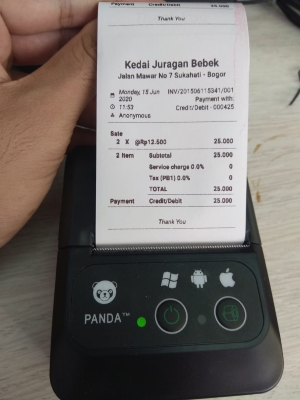
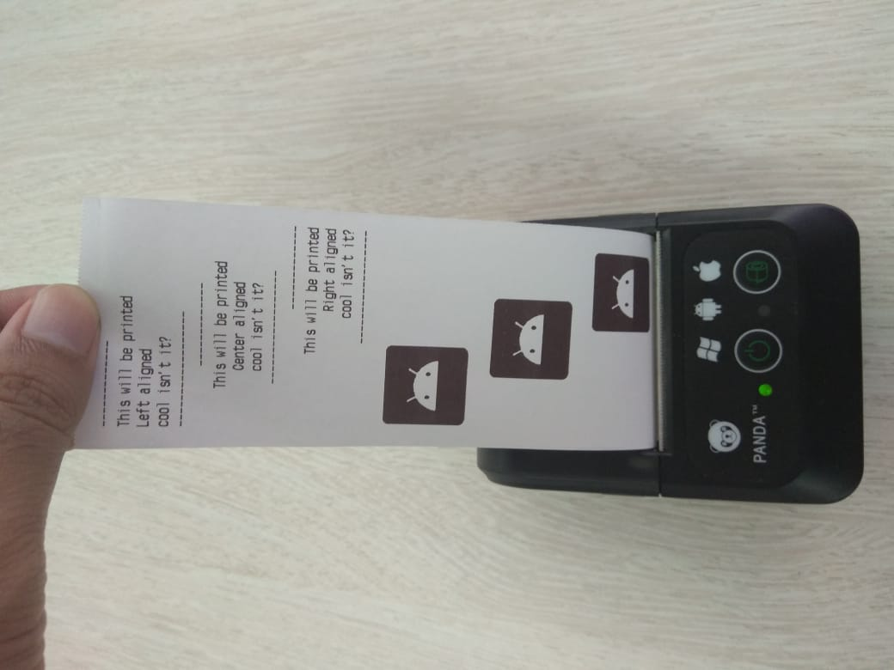
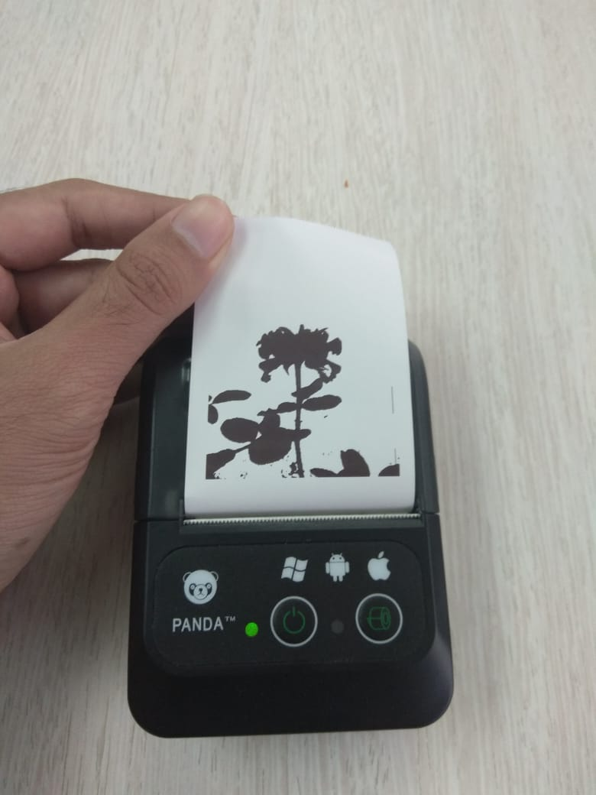
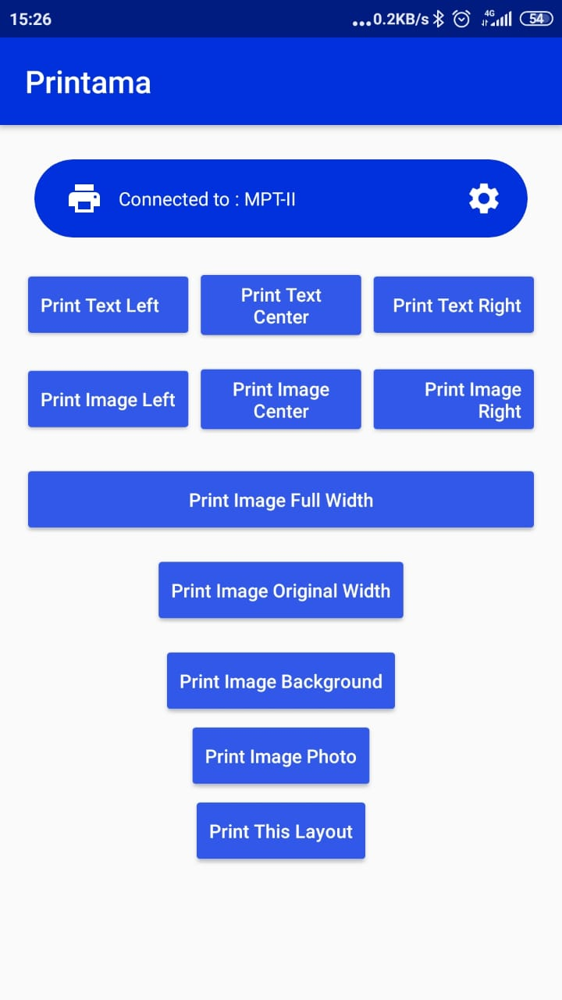

<p align="center">
  <h1 align="center">Printama</h1>
</p>

<p align="center">
  
</p>

<p align="center">
  <a href="https://jitpack.io/#anggastudio/Printama"></a>
  <a href="LICENSE"></a>
  <a href="https://github.com/anggastudio/Printama/pulls"></a>
  <a href="https://github.com/anggastudio/Printama/graphs/contributors"></a>
  <a href="https://twitter.com/angga_studio"></a>
  <a href="https://github.com/anggastudio"></a>
  <p align="center">Android library for bluetooth thermal printer.<br>Tested to many 2 inch bluetooth thermal printers.</p>
</p>

## Screenshots
|Payment Receipt|Print Text and Images|
|---|---|
|||

|Photo|Photo Print Result|
|---|---|
|||

|Screen Layout|Screen Layout Print Result|
|---|---|
|||


## Usage
Currently still in Alpha. Make sure to use java 8+ configuration.
Documentation is in progress. Just take a look at sample project as an
example.

But here for an insight:
**Permissions in your Manifest**
```
<uses-permission android:name="android.permission.BLUETOOTH_SCAN"  android:usesPermissionFlags="neverForLocation"/>
<uses-permission android:name="android.permission.BLUETOOTH_ADVERTISE" />
<uses-permission android:name="android.permission.BLUETOOTH_CONNECT" />
```
**Permission check in your Activity. Call checkPermissions() in your onCreate() method**
```java
 private static String[] PERMISSIONS_STORAGE = {
            Manifest.permission.READ_EXTERNAL_STORAGE,
            Manifest.permission.WRITE_EXTERNAL_STORAGE,
            Manifest.permission.ACCESS_FINE_LOCATION,
            Manifest.permission.ACCESS_COARSE_LOCATION,
            Manifest.permission.ACCESS_LOCATION_EXTRA_COMMANDS,
            Manifest.permission.BLUETOOTH_SCAN,
            Manifest.permission.BLUETOOTH_CONNECT,
            Manifest.permission.BLUETOOTH_PRIVILEGED
    };
    private static String[] PERMISSIONS_LOCATION = {
            Manifest.permission.ACCESS_FINE_LOCATION,
            Manifest.permission.ACCESS_COARSE_LOCATION,
            Manifest.permission.ACCESS_LOCATION_EXTRA_COMMANDS,
            Manifest.permission.BLUETOOTH_SCAN,
            Manifest.permission.BLUETOOTH_CONNECT,
            Manifest.permission.BLUETOOTH_PRIVILEGED
    };

    private void checkPermissions(){
            int permission1 = ActivityCompat.checkSelfPermission(this, Manifest.permission.WRITE_EXTERNAL_STORAGE);
            int permission2 = ActivityCompat.checkSelfPermission(this, Manifest.permission.BLUETOOTH_SCAN);
            if (permission1 != PackageManager.PERMISSION_GRANTED) {
                // We don't have permission so prompt the user
                ActivityCompat.requestPermissions(
                        this,
                        PERMISSIONS_STORAGE,
                        1
                );
            } else if (permission2 != PackageManager.PERMISSION_GRANTED){
                ActivityCompat.requestPermissions(
                        this,
                        PERMISSIONS_LOCATION,
                        1
                );
            }
        }

```
**Show dialog to choose bonded device (printer list)** bind your device initially from
the bluetooth config:
```java
Printama.showPrinterList(this, printerName -> {
    ...
});
```

**Show dialog to choose bonded device (Custom Color)** 
```java
Printama.showPrinterList(this, R.color.colorBlue, printerName -> {
    if (connectedPrinter != null) {
      ...
    }
});
```

**Prepare the text**
```java
String text = "-------------\n" +
                "This will be printed\n" +
                "Left aligned\n" + // or Center or Right
                "cool isn't it?\n" +
                "------------------\n";
```

**Print Text LEFT aligned**
```java
Printama.with(context).connect(printama -> {
    printama.printText(Printama.LEFT, text);
    printama.close();
});
```

**Print Text CENTER aligned**
```java
Printama.with(context).connect(printama -> {
    printama.printText(Printama.CENTER, text);
    printama.close();
});
```

**Print Text RIGHT aligned**
```java
Printama.with(context).connect(printama -> {
    printama.printText(Printama.RIGHT, text);
    printama.close();
});
```

**Print Text JUSTIFY aligned**
```java
Printama.with(this).connect(printama -> {
    printama.printTextJustify("text1", "text2");
    printama.printTextJustify("text1", "text2", "text3");
    printama.printTextJustify("text1", "text2", "text3", "text4");

    printama.printTextJustifyBold("text1", "text2");
    printama.printTextJustifyBold("text1", "text2", "text3");
    printama.printTextJustifyBold("text1", "text2", "text3", "text4");

    printama.setNormalText();
    printama.feedPaper();
    printama.close();
});
```

**Print Text with format**
```java
Printama.with(this).connect(printama -> {
    printama.setSmallText();
    printama.printText("small___________");
    printama.printTextln("TEXTtext");

    printama.setNormalText();
    printama.printText("normal__________");
    printama.printTextln("TEXTtext");

    printama.printTextNormal("bold____________");
    printama.printTextlnBold("TEXTtext");

    printama.setNormalText();
    printama.printTextNormal("tall____________");
    printama.printTextlnTall("TEXTtext");

    printama.printTextNormal("tall bold_______");
    printama.printTextlnTallBold("TEXTtext");

    printama.printTextNormal("wide____________");
    printama.printTextlnWide("TEXTtext");

    printama.printTextNormal("wide bold_______");
    printama.printTextlnWideBold("TEXTtext");

    printama.printTextNormal("wide tall_______");
    printama.printTextlnWideTall("TEXTtext");

    printama.printTextNormal("wide tall bold__");
    printama.printTextlnWideTallBold("TEXTtext");

    printama.printTextNormal("underline_______");
    printama.setUnderline();
    printama.printTextln("TEXTtext");

    printama.printTextNormal("delete line_____");
    printama.setDeleteLine();
    printama.printTextln("TEXTtext");

    printama.setNormalText();
    printama.feedPaper();
    printama.close();
});
```

**Print Bitmap / Image LEFT aligned**
```java
Bitmap bitmap = BitmapFactory.decodeResource(getResources(), R.mipmap.ic_launcher);
Printama.with(context).connect(printama -> {
    printama.printImage(Printama.LEFT, bitmap, 200);
    printama.close();
});
```

**Print Bitmap / Image CENTER aligned**
```java
Bitmap bitmap = BitmapFactory.decodeResource(getResources(), R.mipmap.ic_launcher);
Printama.with(context).connect(printama -> {
    printama.printImage(Printama.CENTER, bitmap, 200);
    printama.close();
});
```

**Print Bitmap / Image RIGHT aligned**
```java
Bitmap bitmap = BitmapFactory.decodeResource(getResources(), R.mipmap.ic_launcher);
Printama.with(context).connect(printama -> {
    printama.printImage(Printama.RIGHT, bitmap, 200);
    printama.close();
});
```

**Print Bitmap / Image FULL size**
```java
Bitmap bitmap = BitmapFactory.decodeResource(getResources(), R.mipmap.ic_launcher);
Printama.with(context).connect(printama -> {
    printama.printImage(bitmap, Printama.FULL_WIDTH);
    printama.close();
});
```

**Print Bitmap / Image ORIGINAL size**
```java
Bitmap bitmap = BitmapFactory.decodeResource(getResources(), R.mipmap.ic_launcher);
Printama.with(context).connect(printama -> {
    printama.printImage(bitmap); // original size, centered as default
    printama.close();
});
```

**Print Drawable Vector**
```java
Bitmap bitmap = Printama.getBitmapFromVector(this, R.drawable.ic_launcher_background);
Printama.with(this).connect(printama -> {
    printama.printImage(bitmap, Printama.ORIGINAL_WIDTH);
    printama.close();
});
```

**Print Layout View**

using print layout view, you can design your receipt on your layout xml or dsl, and pass the root view as parameter
```java
View view = findViewById(R.id.root_view);
Printama.with(this).connect(printama -> {
    printama.printFromView(view);
    printama.close();
});
```

## Feature
* Dialog to choose bonded bluetooth device list.
* Print Text with LEFT, CENTER, or RIGHT Alignment.
* Print Text with JUSTIFY Alignment.
* Print auto grayscale Bitmap with Custom width and Alignment.
* Print photo (grayscaled)
* Print your android screen or layout by passing the root view
* Print vector drawable
* Tested with 2 inch Bluetooth Thermal Printers.


## Contributing

You can simply :
* a pull request, or
* raise an issue ticket, or
* request additional feature by raise a ticket.


## Download

Minimum Android SDK Version 16

#### Gradle
**Step 1.** Add it in your root build.gradle at the end of repositories:
```gradle
allprojects {
  repositories {
    ...
    maven { url 'https://jitpack.io' }
  }
}
```

**Step 2.** Add the dependency

version: 
```gradle
dependencies {
  implementation 'com.github.anggastudio:Printama:<version>'
```
#### Other like Maven, SBT, Leiningen
**just visit the jitpack page**
[Printama Jitpack](https://jitpack.io/#anggastudio/Printama)

## License

[Apache License 2.0](LICENSE)

## Thanks To:

- [imrankst1221](https://github.com/imrankst1221/Thermal-Printer-in-Android)
- [MFori](https://github.com/MFori/Android-Bluetooth-Printer)
- <a href="https://github.com/anggastudio/Printama/graphs/contributors"></a>
- WP

## Next Step:

- release 1.0.0 to make it more stable
- enhance documentation
- create a video tutorial
- testing on more printers
- (still in my mind) migrate to kotlin

## Support me:

I notice that some of you very happy with this library and some of you wants to give support. But I
also notice some of you wants to support me anonymously. Well then, I appreciate if you want to
support me by sending some ETH or BNB via these wallet addresses:

- 0x2fB5BF149Ac0765b546DB4feD3E64FBF9f14eb8a
- 0x7A65cc9d8031f67847662cC92Fa93b71dCc95605
